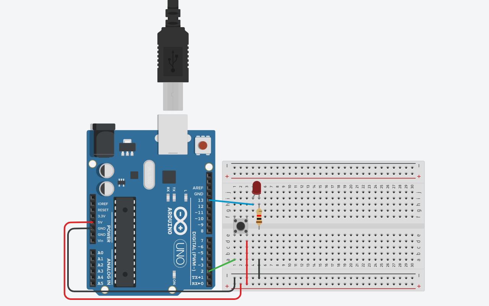

# Project 2 - ButtonDigitalRead

    

## Components
<table>

<tr>
 <th>Count</th>
 <th>Component</th>
</tr>
<tr>
    <td>1</td>
    <td>Arduino Uno R3</td>
</tr>
<tr>
    <td>1</td>
    <td>Red LED</td>
</tr>
<tr>
    <td>1</td>
    <td>Button</td>
</tr>
<tr>
    <td>1</td>
    <td>1 kΩ Rezistor</td>
</tr>
</table>