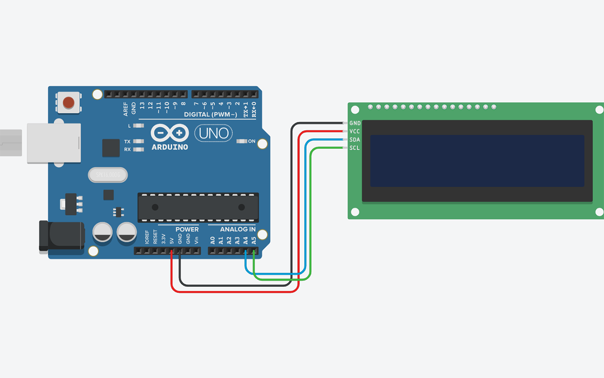

# Project 5 - LiquidCrystal I2C Test

    

## Components
<table>

<tr>
 <th>Count</th>
 <th>Component</th>
</tr>
<tr>
    <td>1</td>
    <td>Arduino Uno R3</td>
</tr>
<tr>
    <td>1</td>
    <td>MCP23008, 32 LCD 16 x 2 (I2C)</td>
</tr>
</table>